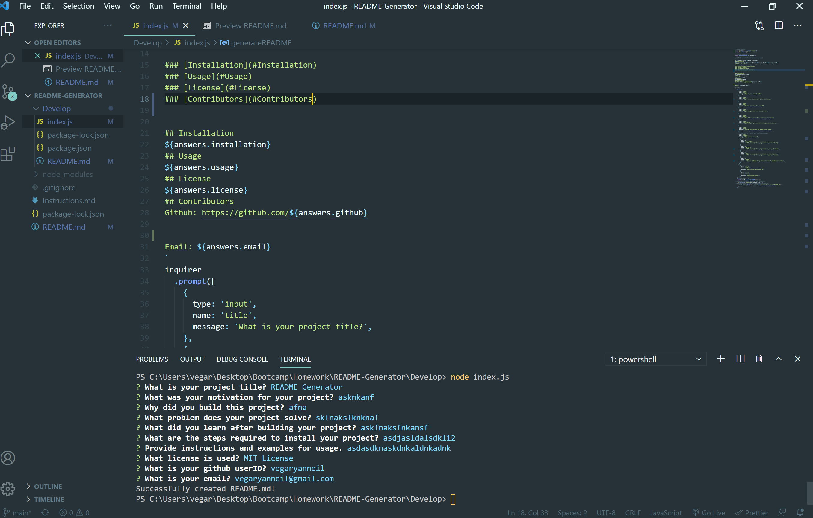

# README-Generator
## Description

I created a README Generator using inquirer.js as a way to streamline the process of creating a README file. I found that I took a long time completing this portion and it tends to be one of the last items I complete. After working on a project, I do not want to spend another 30 minutes to an hour explaining the project. I learned a lot about how inquirer.js works and how to utilize it.

I also learned a bit about licensing, but still have little clue about it.

## Installation

You can pull the files I used via github, then all you need is to have node.js and inquirer.js installed.

## Usage 

To use this tool, you need to use the Command Line Interface and type in "node index.js" this will prompt the questions for users to answer. Once all the questions are completed it will generate the README.md.

## Contributors / Links

Ryan Vega

https://github.com/vegaryanneil/README-Generator

